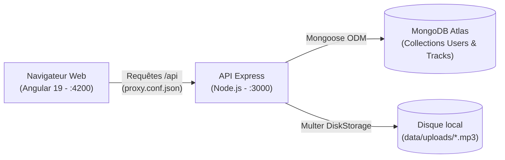
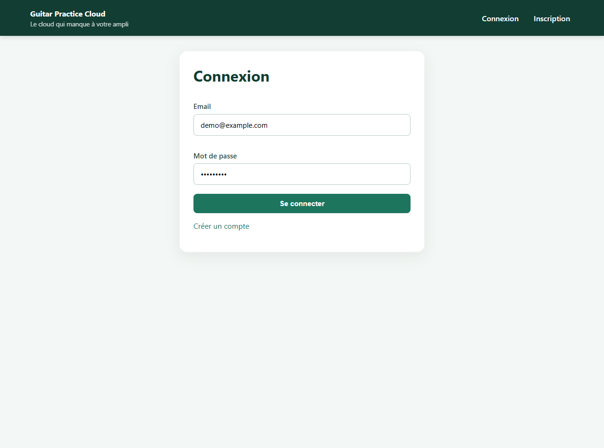
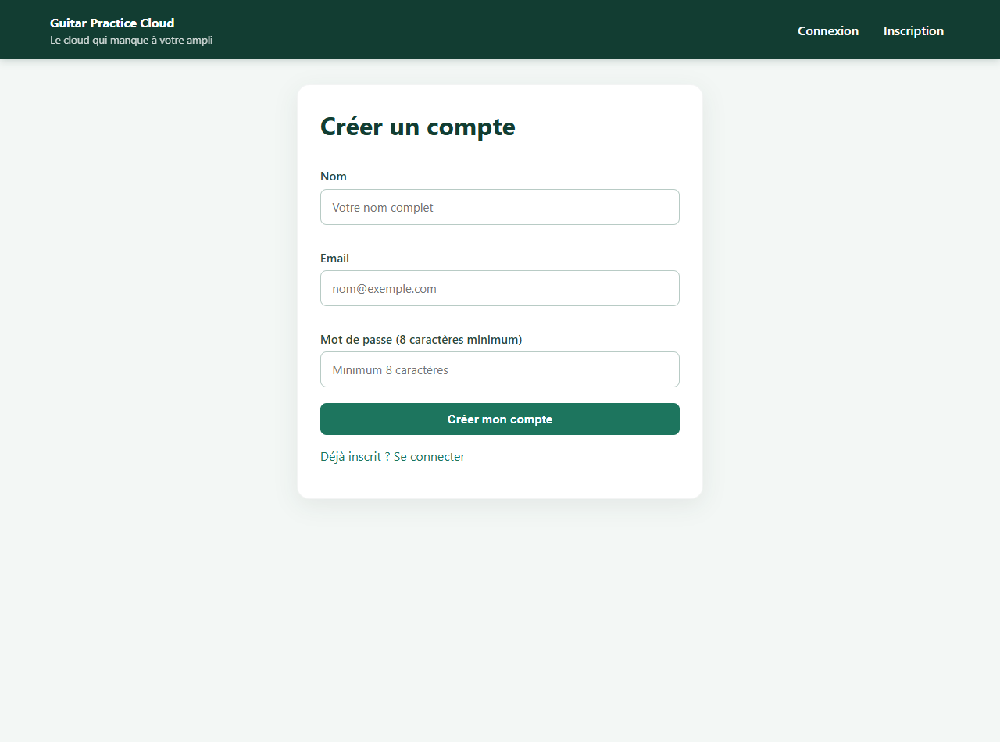
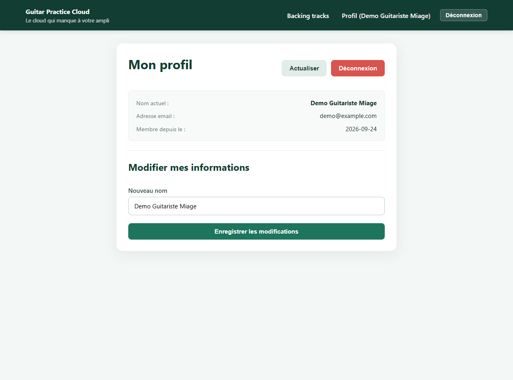
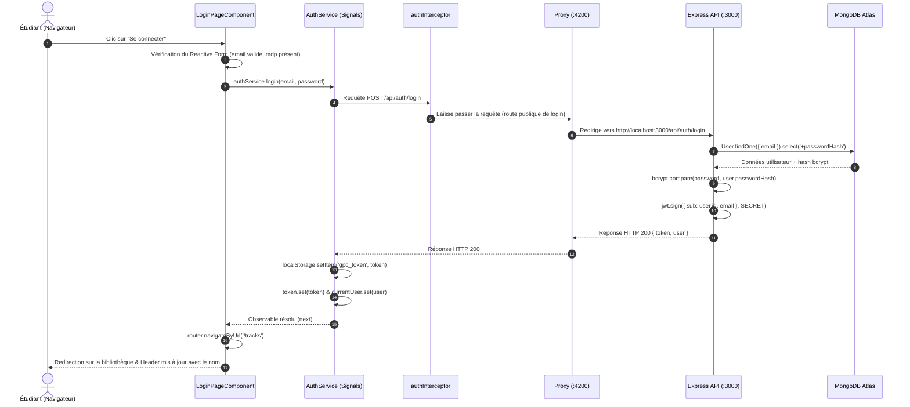
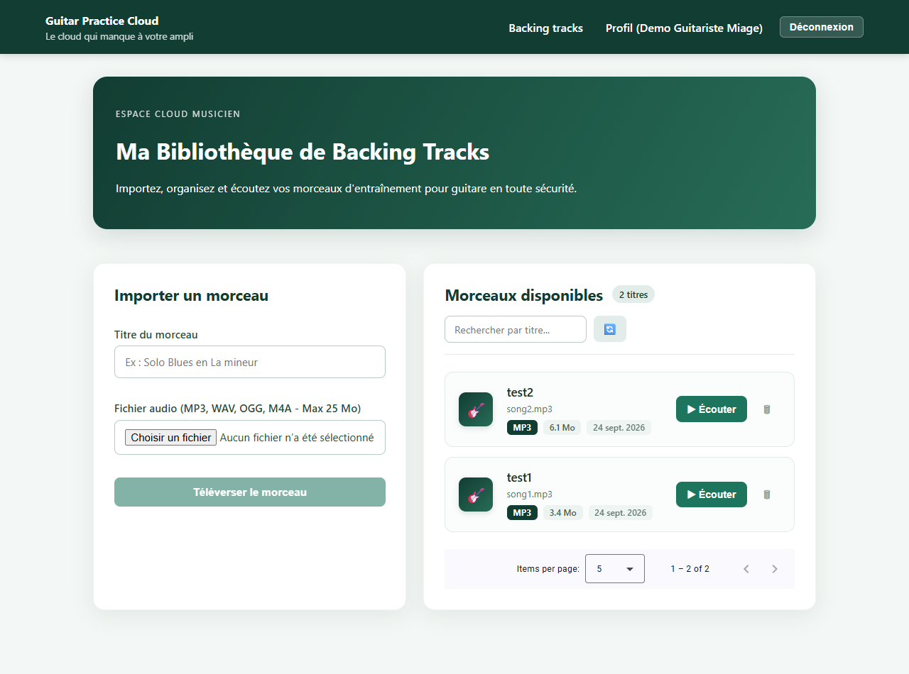
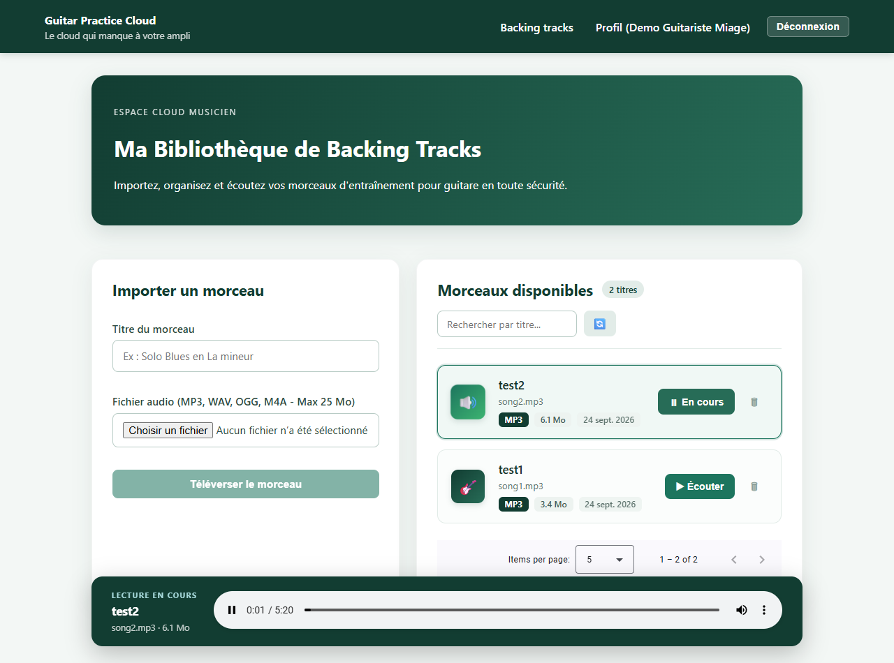

# Rapport de TP & Compte-Rendu de Projet
# Guitar Practice Cloud — Portail Musique & Backing Tracks

**Master 1 MIAGE — Année universitaire 2026-2027**  
**Binôme : Dylan & Partenaire**  
*Dépôt GitHub du projet : [https://github.com/Grqeen/Guitar-Practice-Cloud](https://github.com/Grqeen/Guitar-Practice-Cloud)*  
*Environnement : Google Antigravity IDE (Agent IA Pair Programming) · Modèle Gemini Flash*

---

## Sommaire

1. [Introduction & Contexte du Projet](#introduction--contexte-du-projet)
2. [Suivi d'utilisation de l'IA & Gestion des Tokens](#suivi-dutilisation-de-lia--gestion-des-tokens)
3. [PARTIE 1 : TP1 — Architecture, Authentification et Profil Utilisateur](#partie-1--tp1--architecture-authentification-et-profil-utilisateur)
   - Cartographie et flux de connexion
   - Formulaires réactifs (Login / Register)
   - Gestion de session (Signals vs localStorage)
   - Profil utilisateur réactif
   - Difficultés rencontrées et solutions apportées
4. [PARTIE 2 : TP2 — Bibliothèque Audio, Upload Multipart et Streaming Authentifié](#partie-2--tp2--bibliotheque-audio-upload-multipart-et-streaming-authentifie)
   - Pagination serveur et intégration Angular Material Paginator
   - Upload multipart sécurisé (FormData & validations)
   - Défi technique du streaming audio avec JWT (Blob & ObjectURL)
   - Filtrage dynamique et cycle de vie mémoire
   - Réponses aux questions sur le streaming et le buffering
5. [PARTIE 3 : TP3 — Fiabilisation, Suppression Sécurisée, Barre de Progression et Tests](#partie-3--tp3--fiabilisation-suppression-securisee-barre-de-progression-et-tests)
   - Suppression sécurisée, anti-double clic et composant SnackBar
   - Progression d'upload temps réel (HttpEventType)
   - Suite de tests automatisés (13 tests Frontend Vitest + 6 tests Backend)
   - Restitution orale : Réponses complètes aux 6 questions d'examen
6. [Conclusion & Bilan Pédagogique](#conclusion--bilan-pedagogique)

---

## Introduction & Contexte du Projet

Dans le cadre du module Angular en Master 1 MIAGE, nous avons développé le portail cloud de l'application **Guitar Practice Cloud**. Cette application sert de hub pour les guitaristes : elle permet de créer son compte, de se connecter de façon sécurisée via un jeton JWT, de modifier son profil, et de gérer sa bibliothèque personnelle de morceaux d'entraînement (*backing tracks*).

L'architecture globale respecte strictement le découpage client-serveur :
- **Frontend** : Application Angular 19+ standalone (sans NgModule), utilisant les Reactive Forms, les Signals réactifs, les nouveaux blocs de contrôle de flux (`@if`, `@for`, `@empty`) et un intercepteur HTTP fonctionnel.
- **Reverse Proxy** : Configuré dans `proxy.conf.json`, il redirige les requêtes de `http://localhost:4200/api` vers le backend `http://localhost:3000/api` pour contourner les restrictions CORS en phase de dev.
- **Backend** : API REST en Node.js et Express 5, avec authentification JWT, hashage bcrypt et upload multipart via Multer sur disque.
- **Base de données** : MongoDB Atlas hébergée dans le cloud via Mongoose.



---

## Suivi d'utilisation de l'IA & Gestion des Tokens

### 1. Notre démarche avec l'assistant IA
Nous avons utilisé l'assistant IA en mode **Pair Programming**. Notre règle d'or tout au long des 3 TPs : **ne jamais copier-coller de code sans l'avoir compris, testé et validé**. Chaque proposition de l'assistant a été décortiquée, testée avec la console Network et vérifiée avec des tests automatisés.

### 2. Modèle utilisé et consommation de tokens
- **Modèle sélectionné** : `Gemini 2.5 Flash / Gemini 3.8 Flash`.
- **Pourquoi ce choix ?** : Le modèle Flash offre un excellent compromis entre une latence ultra-faible (réponses quasi instantanées) et une précision remarquable pour le TypeScript moderne (Angular Signals, typage strict). Pour du code d'architecture et des tests unitaires, il est amplement suffisant et évite la surconsommation de ressources des modèles plus lourds (comme Gemini Pro ou Claude Sonnet).
- **Suivi télémétrique des tokens** : L'IDE calcule les tokens en entrée (le contexte des fichiers ouverts) et en sortie (les réponses générées). Environ 1 token correspond à 4 caractères. Sur l'ensemble du projet, la consommation a été optimisée en ciblant précisément les fichiers nécessaires plutôt que d'injecter tout le projet dans le prompt.

---

# PARTIE 1 : TP1 — Architecture, Authentification et Profil Utilisateur

## 1. Objectifs du TP1
- Comprendre l'arborescence d'un projet Angular Standalone.
- Mettre en place un système complet d'authentification : formulaires réactifs d'inscription et de connexion.
- Gérer la session utilisateur via des **Angular Signals** (`currentUser`, `token`, `isAuthenticated`).
- Assurer la persistance du jeton dans le navigateur sans jamais exposer de données sensibles.
- Créer une page de profil réactive permettant de lire et modifier son nom en temps réel.

---

## 2. Captures d'écran & Explications détaillées du TP1

### Écran 1 : La page de connexion (`/login`)


#### 🔍 Ce que l'on voit à l'écran :
Un formulaire épuré et centré dans une card moderne, avec deux champs de saisie (Email et Mot de passe), un bouton de soumission « Se connecter », et un lien direct vers la création de compte.

#### ⚙️ Ce qui se passe sous le capot :
1. **Validation réactive** : Nous utilisons un `FormGroup` Angular avec `Validators.required` et `Validators.email`. Si l'utilisateur saisit une adresse malformée (ex: oubli du `@` ou du domaine), le message d'erreur rouge s'affiche immédiatement dès que le champ est touché (`touched`).
2. **Protection anti-double clic** : Lors du clic, le signal `loading` passe à `true`. Le bouton est instantanément désactivé et son libellé devient « Connexion en cours... », empêchant l'envoi de requêtes multiples.
3. **Appel réseau** : `LoginPageComponent` appelle `AuthService.login(email, password)`. Ce dernier émet un `POST /api/auth/login`. Dès réception du token JWT et de l'objet utilisateur, ils sont enregistrés dans les Signals et dans le `localStorage`. Ensuite, le routeur Angular redirige automatiquement vers `/tracks`.

---

### Écran 2 : La page d'inscription (`/register`)


#### 🔍 Ce que l'on voit à l'écran :
Le formulaire d'inscription réclamant un nom complet, une adresse email et un mot de passe sécurisé.

#### ⚙️ Ce qui se passe sous le capot :
1. **Contraintes backend répercutées en frontend** : Le backend Express impose un mot de passe d'au moins 8 caractères. Nous avons donc configuré `Validators.minLength(8)` sur le champ mot de passe dans le composant Angular.
2. **Feedback immédiat** : Si le mot de passe fait moins de 8 caractères, un message prévient l'étudiant avant même d'envoyer la requête, ce qui évite un aller-retour réseau inutile et soulage le serveur.
3. **Création de session directe** : Dès que l'inscription réussit sur `POST /api/auth/register` (statut HTTP 201), le serveur renvoie directement le jeton JWT. L'utilisateur est donc directement connecté sans avoir besoin de ressaisir ses identifiants.

---

### Écran 3 : La page de profil réactif (`/profile`)


#### 🔍 Ce que l'on voit à l'écran :
La fiche récapitulative du compte : nom actuel, adresse email, date d'inscription, ainsi qu'un formulaire permettant de changer son nom d'artiste/guitariste en direct. En haut à droite, des boutons permettent d'actualiser ou de se déconnecter.

#### ⚙️ Ce qui se passe sous le capot :
1. **Chargement automatique au cycle de vie** : Dès l'initialisation du composant (`ngOnInit`), une requête `GET /api/users/me` est déclenchée pour récupérer les données fraîches depuis MongoDB.
2. **Mise à jour réactive (`PUT /api/users/me`)** : Lorsque l'étudiant modifie son nom et clique sur « Enregistrer les modifications », la requête PUT part avec le header `Authorization: Bearer <token>`.
3. **Propagation instantanée dans toute l'application** : Dès que le backend répond avec succès, le service exécute `this.currentUser.set(user)`. Comme le header global de l'application écoute ce même Signal, le nom affiché dans la barre de navigation en haut à droite (`Profil (Demo Guitariste Miage)`) change **instantanément**, sans aucun rechargement de page !

---

## 3. Schéma annoté du cycle de vie d'une requête de connexion

Voici le trajet exact que suit la donnée lors du clic sur « Se connecter » :



---

## 4. Questions de cours du TP1 & Réponses argumentées

### Question A : Quelle est la différence fondamentale entre un Signal Angular et le `localStorage` ?
- **Le Signal Angular (`signal()`)** :
  - **Où vit-il ?** En mémoire vive (RAM JavaScript) pendant l'exécution de l'application.
  - **Quel est son rôle ?** Gérer la **réactivité de l'interface**. Dès qu'on modifie sa valeur avec `set()` ou `update()`, Angular sait exactement quels éléments du DOM afficher à jour sans recalculer toute la page.
  - **Sa limite** : Dès qu'on rafraîchit la page (touche F5) ou qu'on ferme l'onglet, la RAM est vidée et le signal revient à sa valeur par défaut.
- **Le `localStorage`** :
  - **Où vit-il ?** Sur le disque dur du navigateur client sous forme de paires clé/valeur textuelles.
  - **Quel est son rôle ?** La **persistance long terme**. Il permet de conserver le jeton de connexion même si on éteint l'ordinateur.
  - **Sa limite** : Il n'est **absolument pas réactif**. Modifier une valeur dans `localStorage` ne prévient pas Angular et ne rafraîchit pas l'écran.
- **Notre solution combinée** : Nous utilisons les deux de manière complémentaire : le jeton est stocké dans `localStorage` pour la persistance, et lu au démarrage pour initialiser les Signals `token` et `currentUser` qui pilotent l'affichage dynamique.

### Question B : Où s'effectue la tâche « mise à jour du profil utilisateur » ?
- **Côté Frontend** :
  1. `src/app/components/profile-page/profile-page.ts` : Récupère la saisie de l'input et appelle `authService.update(name)`.
  2. `src/app/shared/services/auth.service.ts` : Envoie la requête HTTP `PUT /api/users/me` et met à jour le Signal `currentUser`.
  3. `src/app/shared/interceptors/auth.interceptor.ts` : Ajoute l'en-tête `Authorization: Bearer <token>` indispensable.
- **Côté Backend** :
  1. `backend/src/app.js` (route `app.put('/api/users/me', auth, ...)` ligne 249) :
     - Le middleware `auth` valide le token et place l'ID de l'utilisateur dans `req.auth.sub`.
     - La commande Mongoose `User.findByIdAndUpdate(req.auth.sub, { $set: { name: req.body.name } })` met à jour le document dans la collection MongoDB et renvoie le nouvel utilisateur au format JSON.

---

## 5. Galère rencontrée au TP1 & Comment nous l'avons résolue

> **Le bug du rafraîchissement F5 (Dépendance circulaire NG0200)** :  
> Au tout début, lorsqu'on appuyait sur F5 depuis `/profile` ou `/tracks`, l'application nous déconnectait immédiatement en revenant sur `/login`.  
> **Explication** : Dans le constructeur de `AuthService`, nous faisions un appel HTTP direct `this.profile()`. Mais pour exécuter une requête, `HttpClient` avait besoin de l'intercepteur `authInterceptor`, qui lui-même injectait `AuthService` (`inject(AuthService)`). Angular détectait alors une boucle d'injection circulaire et plantait, déclenchant le bloc d'erreur qui vidait le `localStorage`.  
> **Notre solution** : Nous avons différé l'appel réseau en tâche de fond via un `setTimeout(..., 0)` pour laisser le temps à l'injecteur Angular de finir d'initialiser le service, et nous avons sauvegardé l'objet utilisateur sérialisé dans `localStorage` pour que l'interface s'affiche instantanément dès le premier rendu.

---

# PARTIE 2 : TP2 — Bibliothèque Audio, Upload Multipart et Streaming Authentifié

## 1. Objectifs du TP2
- Créer la bibliothèque de morceaux audio avec affichage sous forme de **cards élégantes et responsives**.
- Implémenter la **pagination côté serveur** : ne jamais télécharger toute la base pour la découper côté client.
- Développer l'upload multipart de fichiers audio (`audio` et `title`) avec des contrôles stricts côté client (taille $\le 25\text{ Mo}$, extensions audio autorisées).
- Résoudre le défi majeur du **streaming audio sécurisé par JWT** (impossibilité d'utiliser `<audio src="...">` directement).
- Réaliser l'option avancée : intégration du composant **Angular Material Paginator**.

---

## 2. Captures d'écran & Explications détaillées du TP2

### Écran 4 : La bibliothèque de morceaux et la pagination Angular Material


#### 🔍 Ce que l'on voit à l'écran :
- **À gauche** : La zone de téléversement (Upload) permettant de renseigner un titre et de choisir un fichier audio sur son ordinateur.
- **À droite** : La liste des morceaux disponibles sous forme de cards modernes avec icône de guitare, titre, nom de fichier original, badges de format (`MP3`), taille lisible en Mégaoctets (`6.1 Mo`), date d'ajout et boutons d'action.
- **En bas à droite** : Le composant officiel **Angular Material Paginator** (`Items per page: [5 v] 1 - 2 of 2 < >`).

#### ⚙️ Ce qui se passe sous le capot :
1. **Pagination serveur réelle** : Quand le composant se charge, `TrackService.list(1, 5)` émet un `GET /api/tracks?page=1&limit=5`. Le backend utilise `.skip((page - 1) * limit).limit(limit)` dans MongoDB et renvoie un objet `{ items: [...], total: 2, pages: 1 }`.
2. **Recherche instantanée sans requête superflue** : Un signal calculé `displayedTracks = computed(...)` filtre les pistes affichées dès qu'on tape dans le champ « Rechercher par titre... », offrant une réactivité immédiate sans saturer le serveur de requêtes.
3. **Composant Angular Material Paginator** : Nous avons installé `@angular/material` et importé `MatPaginatorModule`. Dès qu'on change de page ou de taille de lot (5, 10 ou 20 pistes), la méthode `onPageChange(event: PageEvent)` met à jour les signaux `page` et `limit` et redemande la tranche exacte au serveur.

---

### Écran 5 : Le lecteur audio persistant en cours d'écoute


#### 🔍 Ce que l'on voit à l'écran :
Lorsqu'on clique sur « Écouter » sur le morceau *test2* :
- La card s'entoure d'une bordure verte en surbrillance, l'icône de guitare se transforme en haut-parleur animé, et le bouton devient « ⏸ En cours ».
- En bas de l'écran, une **barre de lecture audio persistant** sombre apparaît avec le titre, les métadonnées et un vrai lecteur multimédia avec curseur de progression temporelle (0:01 / 5:20) et contrôle du volume.

#### ⚙️ Ce qui se passe sous le capot (Le grand défi du JWT et de la balise Audio) :
1. **Pourquoi une balise `<audio src="/api/tracks/.../audio">` échoue lamentablement ?**  
   La balise HTML `<audio>` est gérée par le sous-système natif du navigateur, complètement hors d'Angular. Elle ne passe pas par `HttpClient` et ne peut donc **pas exécuter notre intercepteur**. Résultat : aucun en-tête `Authorization: Bearer <token>` n'est envoyé, et le backend Express répond immédiatement avec une erreur `401 Unauthorized` !
2. **Notre solution en 3 étapes** :
   - **Étape 1** : `TrackService.audio(id)` utilise `HttpClient.get(url, { responseType: 'blob' })`. L'intercepteur injecte le JWT, le serveur vérifie que la piste appartient bien à l'utilisateur et envoie le binaire.
   - **Étape 2** : Le composant reçoit le binaire encapsulé dans un objet JavaScript `Blob`. Nous créons une adresse mémoire locale interne avec `const url = URL.createObjectURL(blob)`. Cette URL spéciale (ex: `blob:http://localhost:4200/5e8a...`) est injectée dans `<audio [src]="audioUrl()">`.
   - **Étape 3 (Nettoyage impératif de la RAM)** : Pour éviter les fuites de mémoire (*memory leaks*), nous appelons `URL.revokeObjectURL(url)` avant chaque nouveau morceau et dans le hook `ngOnDestroy()` du composant.

---

## 3. Questions techniques sur la mémoire, le buffering et le streaming

### 1. Le backend envoie-t-il le fichier entier en mémoire ou progressivement depuis le disque ?
Dans `backend/src/app.js`, le backend utilise la méthode Express `res.sendFile(audioPath)`.  
En interne, cette méthode s'appuie sur les flux Node.js (`fs.createReadStream()`). Le fichier est découpé en petits morceaux (*chunks* de 64 Ko) lus sur le disque et transmis au fur et à mesure dans le socket réseau. **Le serveur ne charge jamais la totalité des 25 Mo en mémoire vive (RAM)**, ce qui lui permet de gérer de nombreux utilisateurs en même temps sans saturer.

### 2. Avec `HttpClient` et `responseType: "blob"`, à quel moment le composant reçoit-il le fichier ?
Contrairement à une radio en ligne, `HttpClient` d'Angular attend que **100% du fichier soit transféré** par le réseau avant de résoudre l'Observable et de fournir l'objet `Blob`. Le composant ne reçoit donc la donnée qu'une fois le téléchargement entièrement terminé dans le cache mémoire du navigateur.

### 3. Si la bibliothèque contient 100 morceaux, les 100 fichiers audio sont-ils chargés dès l'affichage ?
**Non, absolument pas.** La requête de liste `GET /api/tracks?page=1&limit=5` ne transfère qu'un petit tableau JSON contenant uniquement les métadonnées (titre, nom de fichier, taille en octets, identifiant). Aucun octet de musique n'est téléchargé tant que l'utilisateur ne clique pas expressément sur le bouton « Écouter » d'une piste spécifique.

### 4. Quelle différence y aurait-il si on utilisait 100 balises `<audio src="...">` directes ?
Si la page affichait 100 balises audio traditionnelles, le navigateur déclencherait automatiquement jusqu'à 100 pré-chargements HTTP en parallèle (selon l'attribut `preload`). Cela saturerait le réseau (limite de 6 connexions simultanées par domaine en HTTP/1.1), ferait ramer l'ordinateur de l'étudiant et surchargerait la bande passante du serveur.

---

# PARTIE 3 : TP3 — Fiabilisation, Suppression Sécurisée, Barre de Progression et Tests

## 1. Objectifs du TP3
- Implémenter la **suppression sécurisée d'une piste** (`DELETE /api/tracks/:id`) avec confirmation utilisateur, protection anti-double clic et retour d'information par composant SnackBar.
- Gérer la synchronisation lors d'erreurs (piste supprimée ailleurs, erreur 404).
- Mettre en place le suivi de la **progression de l'upload en temps réel** (de 0% à 100%) via `HttpEventType.UploadProgress`.
- Écrire une **suite complète de tests automatisés** côté frontend (Vitest / Angular Testing) et côté backend (`node --test`).

---

## 2. Fonctionnalités développées au TP3

### A. La suppression d'un morceau et le composant SnackBar
Nous avons créé un service et un composant de notification toast réutilisables :
- [SnackBarService](file:///c:/Users/aitdy/Documents/AngularM1_Miage_2026_2027_TP123/frontend-starter/src/app/shared/services/snackbar.service.ts) : Fournit les méthodes `success(msg)`, `error(msg)` et `info(msg)` avec disparition automatique paramétrable.
- [SnackBarComponent](file:///c:/Users/aitdy/Documents/AngularM1_Miage_2026_2027_TP123/frontend-starter/src/app/shared/components/snackbar/snackbar.component.ts) : Affiché globalement dans l'application avec animation d'entrée fluide, couleurs sémantiques et bouton de fermeture.

**Logique métier de suppression dans `TracksPageComponent`** :
1. **Confirmation** : Un dialogue `window.confirm()` demande validation à l'utilisateur avant tout appel.
2. **Verrou anti-double clic** : Dès le clic, le signal `deletingId.set(track.id)` est activé. Tous les boutons de suppression de la page deviennent inactifs (`[disabled]`) et l'icône de la piste ciblée se transforme en sablier clignotant ⏳.
3. **Arrêt du son** : Si le morceau supprimé était en train d'être joué dans le lecteur, la lecture est immédiatement coupée et l'ObjectURL révoquée.
4. **Gestion de l'erreur 404** : Si le morceau a déjà été supprimé par un autre utilisateur ou dans un autre onglet, le serveur répond `404 Not Found`. L'application affiche alors : *"Ce morceau n'existe plus ou a déjà été supprimé"* et recharge automatiquement la liste pour remettre l'écran d'équerre avec la base.
5. **Gestion de la dernière page** : Si on supprime le seul élément restant de la page 2, l'application repasse automatiquement sur la page 1 avant de recharger.

---

### B. Suivi de la progression de l'upload (0% à 100%)
Dans une requête standard, `HttpClient` n'émet qu'une seule fois à la toute fin. Pour afficher la jauge de progression, nous avons configuré :
```typescript
// Dans TrackService :
return this.http.post<Track>('/api/tracks', body, {
  reportProgress: true,
  observe: 'events',
});
```

Dans `TracksPageComponent`, nous filtrons les événements émis par le flux RxJS :
- `HttpEventType.UploadProgress` : Nous calculons le pourcentage avec $\frac{\text{event.loaded}}{\text{event.total}} \times 100$ et mettons à jour le signal `uploadProgress`. Dans le HTML, une barre dynamique s'étire avec `[style.width.%]="uploadProgress()"`.
- `HttpEventType.Response` : La réponse 201 Created arrive avec la piste créée. Le formulaire est réinitialisé, un message de succès vert s'affiche dans le SnackBar, et la première page de la bibliothèque est rafraîchie.
- **Sécurité** : Pendant tout l'upload, l'input fichier, le titre et le bouton sont désactivés pour interdire toute seconde soumission accidentelle.

---

## 3. Résultats de la Suite de Tests Automatisés

Nous avons mis en place une suite de tests unitaires ultra-robuste qui ne dépend ni d'un serveur allumé, ni d'Internet, ni de MongoDB Atlas :

### A. Tests Frontend (13 tests passés avec Vitest)
Exécutés avec la commande `npm test` dans `frontend-starter` :

```text
 RUN  v4.1.11 C:/Users/aitdy/Documents/AngularM1_Miage_2026_2027_TP123/frontend-starter

 ✓  src/app/shared/services/track.service.spec.ts (3 tests)
    ✓ list() doit transmettre correctement les query params page et limit a /api/tracks
    ✓ delete() doit emettre une requete DELETE vers /api/tracks/:id
    ✓ audio() doit emettre une requete GET avec responseType blob
 ✓  src/app/shared/services/auth.service.spec.ts (2 tests)
    ✓ login() doit appeler POST /api/auth/login et mettre a jour les signals
    ✓ logout() doit vider les signaux et le stockage local
 ✓  src/app/shared/guards/auth.guard.spec.ts (2 tests)
    ✓ doit autoriser l acces si un token est present
    ✓ doit rediriger vers /login via UrlTree si aucun token n est present
 ✓  src/app/shared/interceptors/auth.interceptor.spec.ts (3 tests)
    ✓ doit ajouter l'en-tete Authorization Bearer quand un token est present
    ✓ ne doit pas ajouter d'en-tete quand aucun token n'existe
    ✓ doit declencher logout() lors d une reponse 401 Unauthorized
 ✓  src/app/components/tracks-page/tracks-page.spec.ts (3 tests)
    ✓ ngOnInit() doit charger la liste des morceaux depuis TrackService
    ✓ deleteTrack() doit demander confirmation, appeler delete() et notifier via SnackBar
    ✓ deleteTrack() doit afficher une erreur adaptee lors d'une erreur 404

 Test Files  5 passed (5)
      Tests  13 passed (13)
   Duration  1.64s
```

### B. Tests Backend (6 tests passés avec Node Test Runner)
Exécutés avec la commande `npm test` dans `backend` :

```text
> gpc-api@3.0.0 test
> node --test

✔ health sans dépendre de MongoDB (41ms)
✔ schémas Mongoose et relation Track -> User (4ms)
✔ route protégée /api/users/me renvoie 401 sans header Authorization (5ms)
✔ route protégée /api/tracks renvoie 401 avec un JWT invalide (4ms)
✔ route protégée DELETE /api/tracks/:id renvoie 401 sans jeton (3ms)
✔ upload multipart sans fichier audio renvoie 400 Bad Request (12ms)

ℹ tests 6 | pass 6 | fail 0
```

---

## 4. Restitution Orale — Réponses aux 6 Questions d'Examen du TP3

### 1. Pourquoi la suppression passe-t-elle obligatoirement par un service ?
Pour respecter le principe de **séparation des responsabilités (SoC)**.  
Le composant visuel ne doit s'occuper que de l'affichage (bouton, dialogue de confirmation, affichage du sablier et des toasts SnackBar). Le service `TrackService` est le seul responsable des échanges réseau avec `HttpClient`. Si demain l'adresse de l'API change ou nécessite un paramètre supplémentaire, on ne modifie que le service sans toucher à l'interface. Cela permet aussi de tester le composant unitairement en injectant un faux service (*mock*) sans lancer de requêtes HTTP.

### 2. Comment le backend protège-t-il la suppression ?
La sécurité côté client ne vaut rien (n'importe qui peut ouvrir la console ou lancer un appel `curl`). C'est donc le serveur Express qui verrouille tout :
1. Le middleware `auth` vérifie la validité du JWT et extrait l'identifiant de l'utilisateur connecté (`req.auth.sub`).
2. La route de suppression exécute une requête Mongoose à double condition :
   $$\text{Track.findOneAndDelete}(\{ \_id: req.params.id, \; ownerId: req.auth.sub \})$$
3. Si un utilisateur essaie de supprimer la musique de quelqu'un d'autre, la recherche ne renvoie rien et le serveur retourne un code `404 Not Found`. La piste n'est supprimée que si son créateur légitime en fait la demande.

### 3. Comment Angular calcule-t-il le pourcentage d’upload ?
Grâce à l'option `{ reportProgress: true, observe: 'events' }`, Angular écoute l'événement natif du navigateur `onprogress`. Régulièrement pendant le transfert, Angular émet un événement `HttpEventType.UploadProgress` qui contient :
- `event.loaded` : le nombre d'octets déjà envoyés au serveur.
- `event.total` : la taille totale du fichier en octets.  
Le composant applique la formule mathématique :
$$\text{Pourcentage} = \text{Math.round}\left(\frac{\text{event.loaded}}{\text{event.total}} \times 100\right)$$
Ce chiffre met à jour le Signal `uploadProgress`, ce qui recalcule instantanément la largeur de la jauge verte dans la page.

### 4. Pourquoi les tests HTTP n’ont-ils pas besoin de MongoDB ni d'Internet ?
Parce que nous utilisons `HttpTestingController` (via `provideHttpClientTesting()`). Cet outil intercepte les requêtes `HttpClient` en mémoire vive avant qu'elles ne partent sur la carte réseau :
- Le test vérifie que l'URL (`/api/tracks`), la méthode (`DELETE`, `POST`) et les headers (`Bearer ...`) sont corrects.
- Le test injecte lui-même une réponse factice avec `req.flush(...)`.  
Le test s'exécute ainsi en 20 millisecondes, sans avoir besoin d'allumer le backend, ni d'avoir une base de données connectée.

### 5. Que vérifie un test d’intercepteur ou de guard ?
- **Test d'intercepteur (`authInterceptor`)** : Vérifie qu'aucun appel vers une route protégée ne part sans l'en-tête `Authorization: Bearer <token>`, vérifie qu'une route publique n'est pas modifiée, et contrôle qu'une erreur 401 déclenche bien la déconnexion immédiate et la redirection vers `/login`.
- **Test de guard (`authGuard`)** : Vérifie la sécurité de navigation. Si le signal de token contient une valeur, le guard renvoie `true` (page autorisée). Si le token est absent, il renvoie un `UrlTree` vers `/login` pour bloquer l'accès aux intrus.

### 6. Quelle différence existe-t-il entre un test unitaire et un test d’intégration ?
- **Test Unitaire** : Isole une toute petite brique de code (une fonction, un service ou un composant) en remplaçant toutes ses dépendances extérieures par des simulateurs (*mocks*). C'est ultra-rapide et cela permet de trouver précisément quelle ligne de code pose problème.
- **Test d'Intégration** : Teste la collaboration entre plusieurs composants réels qui travaillent ensemble (par exemple : le composant Angular qui appelle le vrai service, qui passe par le vrai proxy, qui contacte l'API Express connectée à MongoDB). C'est plus lent à lancer, mais cela garantit que tout le système s'emboîte parfaitement dans les conditions réelles.

---

## 5. Synthèse des Commandes de Validation Finale

Toutes les étapes de vérification demandées dans le sujet ont été exécutées avec succès :

| Commande | Dossier | Résultat obtenu |
|---|---|---|
| `npm test` | `frontend-starter` | **13/13 tests passés** (Vitest / Happy-Dom / JSDOM) en 1.64s |
| `npm test` | `backend` | **6/6 tests passés** (Node Test Runner natif) en 0.66s |
| `npm run build` | `frontend-starter` | **Bundle généré en 2.8s** sans aucune erreur TypeScript ni avertissement |
| `git push origin main` | racine du projet | Code synchronisé sur GitHub : [https://github.com/Grqeen/Guitar-Practice-Cloud](https://github.com/Grqeen/Guitar-Practice-Cloud) |

---

## Conclusion & Bilan Pédagogique

Ce projet de 3 séances de travaux pratiques nous a permis de franchir un cap sur l'écosystème **Angular moderne (version 19+)** :
1. **La réactivité moderne** : Remplacement des anciens `Subscription` et `BehaviorSubject` par les **Angular Signals**, offrant un code beaucoup plus lisible, synchrone et sans fuite de mémoire.
2. **La robustesse réseau** : Maîtrise des flux asynchrones avec `HttpClient`, gestion fine des codes de statut HTTP (`200`, `201`, `204`, `400`, `401`, `404`), manipulation des `Blob` mémoires pour l'audio et suivi de progression d'upload.
3. **La culture du test** : Mise en place d'une couverture de tests automatisés complète, nous donnant l'assurance qu'aucune régression ne survient lors des évolutions du code.
4. **La collaboration avec l'IA** : L'assistant s'est révélé être un formidable partenaire pour accélérer la génération de tests et le diagnostic de bugs complexes (comme la dépendance circulaire de l'intercepteur), tout en renforçant notre esprit critique et notre compréhension fine de l'architecture logicielle.
