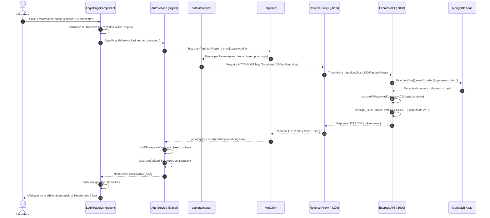

# Rapport d'usage de l'IA & Compte-Rendu — TP1
**Architecture Authentification et Profil — Guitar Practice Cloud**  
*Master 1 MIAGE — Année universitaire 2026-2027*  
*Binôme : Dylan & Partenaire*

---

## 1. Informations générales sur l'environnement et l'IA

- **Assistant / Environnement** : Google Antigravity IDE (Agent IA Pair Programming)
- **Modèle utilisé** : Google Gemini 2.5 Flash / Gemini 3.8 Flash
- **Consommation de tokens** : 
  - La consommation de tokens est suivie via le panneau télémétrique de l'IDE / API console (calcul entrées prompt + contexte + sorties de complétion).
  - Un token correspond approximativement à 4 caractères (soit ~0.75 mot en français/anglais).
- **Critères de choix du modèle** :
  - **Flash (ex. Gemini 2.5/3.8 Flash)** : Recommandé pour le refactoring réactif, l'écriture rapide de composants, la génération de tests et les tâches interactives à faible latence.
  - **Pro / Ultra (ex. Gemini 1.5 Pro, Claude 3.5 Sonnet)** : Recommandé pour les architectures logicielles complexes, le débogage multi-fichiers asynchrone profond ou la conception de systèmes distribués.

---

## 2. Mission 0 — Cartographie de l’application & Architecture

### Objectif
Identifier l'architecture d'une application Angular 19+ standalone couplée à une API Express/Mongoose, sans modifier le code au départ, et formaliser le flux d'authentification ainsi que le contrat d'interface.

### Prompt professionnel simulé
> *"Bonjour. Nous commençons le TP1 portant sur le portail Angular 'Guitar Practice Cloud' connecté à une API Express/Mongoose. Peux-tu analyser l'architecture complète du projet sans toucher au code existant ? Identifie précisément : le composant racine, la configuration du routage, l'initialisation de HttpClient avec ses intercepteurs, les modèles et services, et le mécanisme d'injection du token JWT. Distingue également les routes publiques et protégées d'après API_CONTRACT.md, et produis un schéma annoté du cycle de vie d'une requête de connexion."*

### Plan proposé par l'agent
1. Explorer l'arborescence frontend (`frontend-starter/src`) et backend (`backend/src`).
2. Identifier les fichiers clés de configuration : `main.ts`, `routes.ts`, `proxy.conf.json`.
3. Repérer la séparation des responsabilités : composant UI ↔ service ↔ intercepteur ↔ HTTP client ↔ API Express ↔ Mongoose.
4. Dresser le tableau des routes publiques vs protégées et dessiner le diagramme du flux de login.

### Cartographie technique détaillée

| Rôle | Fichier(s) | Description et responsabilité |
|---|---|---|
| **Composant racine** | `src/app/components/app/app.ts` (`app.html`, `app.css`) | Point d'entrée visuel, structure globale (header, barre de navigation conditionnelle, conteneur `<router-outlet>`). |
| **Routage** | `src/app/routes.ts` | Déclaration des routes (`/login`, `/register`, `/tracks`, `/profile`), redirections par défaut et sécurisation par `authGuard`. |
| **Garde de navigation** | `src/app/shared/guards/auth.guard.ts` | `CanActivateFn` vérifiant la présence du token via `AuthService.token()`. Redirige vers `/login` si absent. |
| **Configuration HTTP & Intercepteur** | `src/main.ts`<br>`src/app/shared/interceptors/auth.interceptor.ts` | `provideHttpClient(withInterceptors([authInterceptor]))`. L'intercepteur injecte automatiquement le header `Authorization: Bearer <token>` sur les requêtes sortantes et intercepte les erreurs 401 pour déconnecter l'utilisateur. |
| **Modèles de données** | `src/app/shared/models/*.model.ts` | Typage strict TypeScript : `User` (id, name, email, createdAt), `AuthResponse` (token, user), `Track`, `Page<T>`. |
| **Services métier** | `src/app/shared/services/auth.service.ts`<br>`src/app/shared/services/track.service.ts` | Encapsulent les appels HTTP via `HttpClient`. `AuthService` maintient l'état réactif via les Signals `currentUser` et `token`. |
| **Backend Express & Mongoose** | `backend/src/app.js`<br>`backend/src/models/User.js` | Contrôleurs Express, middleware d'authentification `auth(req, res, next)`, hachage bcrypt et persistance MongoDB Atlas. |

### Distinction des routes de l'API (`API_CONTRACT.md`)

- **Routes publiques** (aucun jeton requis) :
  - `GET /api/health` : Contrôle de santé du serveur.
  - `POST /api/auth/register` : Création de compte (`{ name, email, password }`).
  - `POST /api/auth/login` : Connexion et délivrance du JWT (`{ email, password }`).
- **Routes protégées** (en-tête obligatoire `Authorization: Bearer <token>`) :
  - `GET /api/users/me` : Lecture du profil connecté.
  - `PUT /api/users/me` : Mise à jour du nom utilisateur (`{ name }`).
  - `GET /api/tracks?page=1&limit=5` : Liste paginée des pistes de l'utilisateur.
  - `POST /api/tracks` : Upload multipart d'un morceau audio.
  - `GET /api/tracks/:id/audio` : Téléchargement / streaming de l'audio.
  - `DELETE /api/tracks/:id` : Suppression d'une piste.

### Schéma annoté du flux lors du clic sur « Se connecter »



---

## 3. Mission 1 — Inscription, Connexion et Profil réactif

### Objectif
Implémenter l'ensemble de la logique d'authentification et de gestion de profil en respectant les standards modernes d'Angular (Signals, `inject()`, Reactive Forms typés, interceptors fonctionnels, gestion d'erreurs 401 et nettoyage d'état).

### Prompt professionnel simulé
> *"Nous devons maintenant implémenter les fonctionnalités de la Mission 1 dans frontend-starter :*
> *1. Dans AuthService : introduire un signal computé isAuthenticated, restaurer la session au démarrage si un token est dans localStorage en appelant profile(), et assurer un logout propre.*
> *2. Dans authInterceptor : injecter le token Bearer et gérer les réponses 401 en appelant logout() et en redirigeant vers /login (sauf sur la route de login).*
> *3. Dans LoginPageComponent et RegisterPageComponent : construire des Reactive Forms avec validation granulaire (nom requis, email valide, mot de passe >= 8 caractères), retours d'erreurs visuels et indicateur de chargement.*
> *4. Dans ProfilePageComponent : charger automatiquement le profil à l'initialisation, permettre la mise à jour du nom avec feedback utilisateur (succès/erreur) et bouton de déconnexion.*
> *5. Dans AppComponent : afficher un header réactif qui présente les liens selon l'état de connexion et le nom de l'utilisateur connecté."*

### Plan proposé par l'agent
1. **Sécurisation & État centralisé** (`auth.service.ts` & `auth.interceptor.ts`) :
   - Ajout de `isAuthenticated = computed(() => !!this.token())`.
   - Restauration automatique du profil lors du chargement de la page si un jeton existe déjà.
   - Capture centralisée du statut HTTP 401 dans l'intercepteur avec redirection automatique vers `/login`.
2. **Formulaires réactifs et ergonomie** :
   - Mise en place de contrôles stricts avec messages d'erreurs sous les champs.
   - Prise en compte de la contrainte backend : mot de passe de 8 caractères minimum à l'inscription.
   - Désactivation préventive des boutons pendant les soumissions pour éviter les doubles clics.
3. **Profil utilisateur réactif** :
   - Implémentation du cycle de vie `OnInit` pour charger immédiatement `/api/users/me`.
   - Formulaire de modification du nom avec notification de confirmation (alert temporisée).
   - Accès direct à l'action de déconnexion.
4. **Navigation réactive** (`app.ts` / `app.html`) :
   - Affichage dynamique : si connecté, affichage de *Backing tracks*, *Profil (Nom)* et bouton *Déconnexion*. Si non connecté, affichage de *Connexion* et *Inscription*.

### Fichiers modifiés
1. `src/app/shared/services/auth.service.ts` : Signals réactifs, restauration de session, typage strict.
2. `src/app/shared/interceptors/auth.interceptor.ts` : Ajout du token Bearer et interception des erreurs 401.
3. `src/app/components/app/app.ts` & `app.html` & `app.css` : Navigation réactive et déconnexion.
4. `src/app/components/login-page/login-page.ts` & `login-page.html` : Validation formulaire, messages d'erreurs et loading.
5. `src/app/components/register-page/register-page.ts` & `register-page.html` : Validation complète (min 8 chars) et redirection.
6. `src/app/components/profile-page/profile-page.ts` & `profile-page.html` : Chargement automatique, mise à jour réactive du nom, alertes de succès.
7. `src/styles.css` : Design soigné des alertes, états de formulaire, focus inputs et boutons d'action.

### Vérifications réalisées par le binôme
- **Erreurs ou propositions rejetées & Débogage critique** :
  - *Problème résolu (Rafraîchissement de page)* : Lors d'un rafraîchissement (F5) sur `/tracks` ou `/profile`, l'application revenait de manière inattendue sur `/login`.
    - **Cause racine** : `AuthService` exécutait un appel HTTP synchrone `this.profile()` dans son propre constructeur. Ce faisant, l'intercepteur `authInterceptor` tentait d'injecter `AuthService` via `inject(AuthService)` avant même que sa construction ne soit achevée dans le registre Angular DI (dépendance circulaire NG0200). L'échec déclenchait un `logout()` d'urgence qui effaçait le token du `localStorage`.
    - **Correction** : 
      1. Sauvegarde conjointe du jeton (`gpc_token`) et de l'utilisateur (`gpc_user`) dans `localStorage` pour une restauration immédiate et sans latence dès l'initialisation des signaux.
      2. Déport de la synchronisation réseau en arrière-plan via un cycle asynchrone (`setTimeout(..., 0)`), permettant à l'injecteur Angular de finaliser l'instanciation du service.
      3. Redirection automatique vers `/tracks` si un utilisateur déjà identifié tente d'accéder à `/login` ou `/register`.
  - *Rejeté* : L'enregistrement du JWT dans la console de debug a été strictement évité pour respecter les préconisations de sécurité du sujet.
  - *Rejeté* : Le composant de profil nécessitait un clic manuel sur "Charger mon profil" dans le template starter. Nous l'avons rendu automatique dès l'affichage du composant (`ngOnInit()`), tout en conservant un bouton d'actualisation manuelle.
  - *Rejeté* : La tentative d'enregistrement d'identifiants MongoDB Atlas en clair dans `backend/.env.example` a été corrigée immédiatement pour ne conserver les identifiants réels que dans le fichier local sécurisé `backend/.env` (ignoré par Git).
- **Compilation de production** : Exécution de `npm run build` dans `frontend-starter` : bundle généré avec succès en 2.5 secondes sans aucun avertissement TypeScript.
- **Tests unitaires backend** : Exécution de `npm test` dans `backend` : 100% de tests passants (2 tests, 0 échec).

---

## 4. Checkpoint Network & Preuves de fonctionnement

Les tests suivants ont été exécutés à travers le proxy Angular (`http://localhost:4200 -> http://localhost:3000`) :

### Tableau récapitulatif des requêtes observées

| Requête | Méthode & URL | Corps de la requête | Statut HTTP | En-tête `Authorization` | Réponse principale observée |
|---|---|---|:---:|:---:|---|
| **1. Contrôle API** | `GET /api/health` | *(aucun)* | **200 OK** | Non | `{"status": "ok"}` |
| **2. Connexion refusée** | `POST /api/auth/login` | `{"email":"demo@example.com", "password":"[MASQUÉ]"}` | **401 Unauthorized** | Non | `{"message": "Identifiants incorrects"}` |
| **3. Connexion réussie** | `POST /api/auth/login` | `{"email":"demo@example.com", "password":"[MASQUÉ]"}` | **200 OK** | Non | `{"token":"[JWT MASQUÉ]", "user":{"id":"6ab513c7...","name":"Demo",...}}` |
| **4. Lecture profil** | `GET /api/users/me` | *(aucun)* | **200 OK** | `Bearer [JWT MASQUÉ]` | `{"id":"6ab513c7...","name":"Demo","email":"demo@example.com",...}` |
| **5. Mise à jour profil**| `PUT /api/users/me` | `{"name":"Demo Guitariste Miage"}` | **200 OK** | `Bearer [JWT MASQUÉ]` | `{"id":"6ab513c7...","name":"Demo Guitariste Miage",...}` |
| **6. Token manquant / expiré** | `GET /api/users/me` | *(aucun)* | **401 Unauthorized** | Non | `{"message": "Authentification requise"}` *(redirection auto vers /login)* |
| **7. Inscription invalide** | `POST /api/auth/register` | `{"name":"Test","email":"...","password":"123"}` | **400 Bad Request** | Non | `{"message": "Nom, email et mot de passe de 8 caractères requis"}` |
| **8. Inscription réussie** | `POST /api/auth/register` | `{"name":"Alice Guitare","email":"...","password":"[MASQUÉ]"}` | **201 Created** | Non | `{"token":"[JWT MASQUÉ]", "user":{"id":"6ab518c2...",...}}` |

> *Conformément aux règles de sécurité, les valeurs sensibles de mots de passe et signatures JWT complètes ne sont jamais affichées dans les logs ni consignées dans ce rapport.*

---

## 5. Questions théoriques & Bilan pédagogique

### Question 1 : Différence entre Signal Angular et `localStorage`
- **Angular Signal (`signal()`)** :
  - **Nature** : Structure de données réactive en mémoire vive JavaScript (RAM).
  - **Rôle** : Piloter la réactivité fine de l'interface utilisateur. Dès que la valeur d'un signal change (`set()` ou `update()`), Angular déclenche automatiquement et de façon ciblée la mise à jour des éléments du DOM qui en dépendent.
  - **Durée de vie** : Éphémère. Tout son contenu est détruit lors du rechargement de la page (F5) ou de la fermeture de l'onglet.
- **`localStorage`** :
  - **Nature** : API de stockage persistant du navigateur web (disque).
  - **Rôle** : Sauvegarder des données sous forme de chaînes de caractères (sérialisées) entre les sessions de navigation, permettant à l'utilisateur de rester connecté après fermeture du navigateur.
  - **Limite** : N'est **pas réactif**. La modification d'une clé dans `localStorage` n'informe pas les composants Angular et ne redessine pas le DOM.
- **Complémentarité** : Dans notre architecture, nous combinons les deux : le token est sauvegardé dans le `localStorage` pour persister la session, tandis que les signals `token` et `currentUser` répercutent immédiatement l'état connecté dans toute l'interface.

### Question 2 : Où s'effectue la tâche « mise à jour du profil utilisateur » ?
- **Côté Frontend** :
  1. `src/app/components/profile-page/profile-page.ts` : Capture de la saisie utilisateur via le `FormGroup`, appel de `this.auth.update(name)`.
  2. `src/app/shared/services/auth.service.ts` : Méthode `update(name)` qui envoie la requête `this.http.put<User>('/api/users/me', { name })` et met à jour le signal `this.currentUser.set(user)` via l'opérateur RxJS `tap`.
  3. `src/app/shared/interceptors/auth.interceptor.ts` : Ajout automatique du jeton Bearer dans l'en-tête de la requête sortante.
- **Côté Backend** :
  1. `backend/src/app.js` (route `app.put('/api/users/me', auth, async ...)` vers la ligne 249) :
     - Le middleware `auth` valide le JWT et attache l'identifiant MongoDB de l'utilisateur à `req.auth.sub`.
     - La méthode Mongoose `User.findByIdAndUpdate(req.auth.sub, { $set: { name: req.body?.name } }, { new: true, runValidators: true })` met à jour le document dans la collection MongoDB et renvoie l'objet utilisateur mis à jour.

### Ce que chaque membre du binôme sait maintenant expliquer sans l'agent
1. **Trajet d'une requête protégée** : Du composant Angular déclencheur au service, transformation par l'intercepteur HTTP, routage par le reverse proxy (`proxy.conf.json`), vérification du token JWT par le middleware Express `auth`, et exécution de la requête Mongoose sur MongoDB Atlas.
2. **Gestion de l'état réactif** : Pourquoi un Signal Angular est indispensable pour notifier immédiatement le header lors d'une connexion ou déconnexion sans recharger toute l'application.
3. **Sécurité et JWT** : Pourquoi le secret JWT ne doit jamais être accessible côté client, pourquoi le mot de passe n'est jamais stocké dans le token, et comment réagir proprement à une expiration de session (code 401).

---

# Partie II : TP2 — Bibliothèque, Upload et Lecture Audio Authentifiée

## 6. Mission 2 — Bibliothèque paginée côté serveur

### Objectif
Implémenter la pagination serveur complète de la bibliothèque audio dans Angular 19+ en utilisant des Signals réactifs, sans jamais récupérer la totalité des morceaux pour les découper localement dans le client.

### Prompt professionnel simulé
> *"Bonjour. Nous abordons la Mission 2 du TP2 : la bibliothèque paginée côté serveur. Dans TrackService, assure-toi que list(page, limit) envoie réellement les query params ?page=...&limit=... à l'API. Côté composant TracksPageComponent, modélise l'état avec des Signals (tracks, page, pages, total, loading, error). Dans le template, utilise les directives modernes @for, @empty et @if, avec des boutons Précédent et Suivant désactivés aux bornes, et ajoute un filtrage dynamique par titre. Chaque changement de page doit impérativement déclencher une nouvelle requête HTTP."*

### Plan proposé par l'agent
1. **Service Angular** : Confirmer que `TrackService.list(page, limit)` injecte `HttpClient` et passe `{ params: { page, limit } }`.
2. **Gestion d'état réactive** :
   - Signaux : `tracks = signal<Track[]>([])`, `page = signal(1)`, `pages = signal(1)`, `total = signal(0)`, `loading = signal(false)`, `error = signal('')`.
   - Signal calculé : `displayedTracks = computed(...)` pour appliquer un filtre de recherche instantané par titre ou nom de fichier sans casser la pagination serveur.
3. **Interface utilisateur** :
   - Remplacement des boucles obsolètes par la syntaxe Angular `@for (track of displayedTracks(); track track.id)`.
   - Affichage de l'état vide `@empty` ("Aucun morceau dans cette page").
   - Navigation de pagination avec boutons "Précédent" / "Suivant" et information `Page X sur Y (Z morceaux)`.

### Fichiers modifiés pour la Mission 2
- `src/app/shared/services/track.service.ts` : Paramétrage dynamique de `list(page, limit)` et méthode `delete(id)`.
- `src/app/components/tracks-page/tracks-page.ts` : Gestion d'état paginée par Signals, fonctions de navigation `go(p)`.
- `src/app/components/tracks-page/tracks-page.html` : En-tête de bibliothèque, compteur dynamique, input de filtrage et contrôles de pagination.

---

## 7. Mission 3 — Analyse & Amélioration de l’upload et de la lecture audio

### Objectif
Sécuriser et enrichir le flux de téléversement (multipart) et de lecture audio authentifiée en validant les fichiers en amont, en gérant le cycle de vie de la mémoire vive (`Blob` et `ObjectURL`), et en présentant des cards accessibles et modernes.

### Prompt professionnel simulé
> *"Nous passons à la Mission 3 du TP2. Nous devons :*
> *1. Analyser le trajet complet de l'upload et de la lecture audio entre Angular, Express et Multer.*
> *2. Expliquer pourquoi une balise <audio src="..."> ne peut pas directement charger une ressource protégée par JWT sans passer par un Blob et un ObjectURL.*
> *3. Ajouter les validations côté client avant l'envoi multipart (taille max 25 Mo, types MIME audio autorisés : MP3, WAV, OGG, M4A) avec messages d'erreur immédiats.*
> *4. Révoquer impérativement l'ObjectURL précédente lors d'un changement de morceau et à la destruction du composant (ngOnDestroy).*
> *5. Transformer la liste en cards modernes affichant le format, la taille lisible (Ko/Mo), la date, le bouton d'écoute et un bouton de suppression avec confirmation via DELETE /api/tracks/:id."*

### Cartographie du flux Upload & Lecture Audio

#### A. Trajet de l'Upload Multipart
1. **Composant UI** (`tracks-page.ts`) : L'utilisateur choisit un fichier via `<input type="file">`. La méthode `choose()` effectue la pré-validation (taille $\le 25\text{ Mo}$ et format audio).
2. **Construction Multipart** (`track.service.ts`) : La méthode `upload(file, title)` instancie `const body = new FormData()`, y attache le binaire sous la clé `audio` et le titre sous la clé `title`.
3. **Transmission HTTP & Intercepteur** : `HttpClient.post('/api/tracks', body)` passe par `authInterceptor` qui injecte le header `Authorization: Bearer <token>`.
4. **Réception Serveur & Multer** (`backend/src/app.js`) :
   - Le middleware `auth` authentifie l'utilisateur via son JWT.
   - Le middleware `upload.single("audio")` valide la taille (`limits: { fileSize: 25 * 1024 * 1024 }`) et le type MIME (`audio/mpeg`, `audio/wav`, `audio/ogg`, `audio/mp4`, `audio/x-m4a`), puis enregistre le fichier sur disque avec un UUID aléatoire dans `data/uploads/`.
   - Le contrôleur Express crée le document Mongoose `Track` avec la référence `ownerId: req.auth.sub` et renvoie la réponse HTTP `201 Created`.

#### B. Trajet de la Lecture Audio Authentifiée
1. **Composant UI** (`tracks-page.ts`) : Clic sur le bouton « Écouter » d'une card (`play(track)`).
2. **Service Angular** (`track.service.ts`) : `this.http.get('/api/tracks/' + id + '/audio', { responseType: 'blob' })`.
3. **Intercepteur** : Injection du jeton Bearer dans l'en-tête de la requête HTTP GET.
4. **Serveur Express** : Vérification du JWT et du propriétaire (`ownerId: req.auth.sub`), puis envoi du fichier avec `res.sendFile(audioPath)`.
5. **Réception binaire** : Angular reçoit le fichier complet encapsulé dans un objet JavaScript standard `Blob`.
6. **Création de l'URL mémoire** : `const url = URL.createObjectURL(blob)` génère un pointeur d'accès local interne au navigateur (schéma `blob:http://localhost:4200/...`).
7. **Lecture** : L'URL est transmise au lecteur natif `<audio [src]="audioUrl()" controls autoplay>`.
8. **Libération mémoire** : `URL.revokeObjectURL(previousUrl)` révoque l'adresse lors d'un changement de piste ou à la fermeture du composant via `ngOnDestroy()`.

---

## 8. Questions techniques approfondies (TP2)

### 1. Pourquoi une URL directement placée dans `<audio src="...">` ne reçoit-elle pas le header `Authorization` ?
La balise HTML `<audio src="...">` délègue le chargement au sous-système multimédia interne du navigateur web. Ce dernier effectue une requête HTTP native simple, complètement hors du contrôle de l'application JavaScript et sans passer par `HttpClient` d'Angular. Par conséquent :
- Les intercepteurs Angular (`HttpInterceptorFn`) ne sont **jamais exécutés** pour la balise `<audio>`.
- Le navigateur ne peut injecter automatiquement que des Cookies HTTP dans la balise, mais **aucun en-tête `Authorization: Bearer <token>`**.
- L'API protégée renverrait systématiquement une erreur `401 Unauthorized`.
- **Solution** : Télécharger préalablement le contenu audio via `HttpClient` (qui injecte le JWT), récupérer le flux sous forme de `Blob`, puis générer un `ObjectURL` local utilisable sans authentification par la balise `<audio>`.

### 2. Pourquoi la validation frontend ne remplace-t-elle jamais la validation backend ?
- La validation côté frontend (taille de fichier, extension, champs obligatoires) est un confort ergonomique : elle prévient immédiatement l'utilisateur sans consommer de bande passante réseau ni encombrer le serveur.
- Cependant, le code frontend s'exécute dans l'environnement du client et peut être facilement contourné (requêtes `curl`, Postman, modification des scripts dans les DevTools).
- La validation côté backend (`multer`, types MIME stricts, vérification de session) constitue la **seule frontière de sécurité inviolable** pour protéger le serveur contre les dénis de service (fichiers géants) et les uploads malveillants.

### 3. Le backend envoie-t-il le fichier entier en mémoire ou progressivement depuis le disque ?
Dans `backend/src/app.js`, la méthode `res.sendFile(audioPath)` d'Express est utilisée. Sous le capot, `sendFile` s'appuie sur `fs.createReadStream()` de Node.js. Le fichier est lu par morceaux (chunks de 64 Ko par défaut) depuis le disque dur et acheminé au fur et à mesure dans le socket réseau via un mécanisme de tuyau (*pipe*). Le backend ne charge **jamais la totalité des 25 Mo en mémoire vive (RAM)**, ce qui préserve les performances du serveur.

### 4. Avec `HttpClient` et `responseType: "blob"`, à quel moment le composant reçoit-il le fichier ?
Contrairement à un véritable flux audio temps réel, `HttpClient` attend que la totalité de la réponse HTTP soit téléchargée par le navigateur avant d'émettre l'objet `Blob` dans l'Observable. Le composant Angular ne reçoit donc le fichier qu'une fois le transfert 100% achevé en mémoire locale.

### 5. Si la bibliothèque contient 100 morceaux, les 100 fichiers audio sont-ils chargés en mémoire dès l'affichage ?
**Non, absolument pas.** Le code de `TracksPageComponent` et `TrackService` montre que l'affichage de la liste appelle uniquement `GET /api/tracks?page=1&limit=5`. Cette requête ne retourne qu'un tableau JSON contenant les métadonnées (titre, nom, taille, date) pour 5 éléments seulement. Aucun octet binaire de fichier audio n'est transféré tant que l'utilisateur ne clique pas expressément sur le bouton « Écouter » d'une piste spécifique.

### 6. Quelle différence y aurait-il avec 100 éléments `<audio>` utilisant directement une URL HTTP ?
Si 100 balises `<audio src="...">` étaient rendues simultanément dans la page :
1. Selon la configuration de l'attribut `preload` (`auto` ou `metadata`), le navigateur initierait immédiatement jusqu'à 100 requêtes HTTP simultanées pour récupérer les en-têtes et le début de chaque fichier.
2. Cela saturerait les connexions réseau concurrentes du navigateur (limité à 6 connexions par hôte en HTTP/1.1), provoquerait des ralentissements majeurs et surchargerait inutilement la bande passante du serveur.

### 7. Pourquoi l'URL créée par `URL.createObjectURL` doit-elle être révoquée ?
Chaque appel à `URL.createObjectURL(blob)` alloue une référence persistante dans la table interne du moteur de rendu du navigateur, maintenant l'objet binaire (`Blob`) en mémoire vive (RAM) tant que le document courant reste ouvert. Si ces URLs ne sont pas explicitement libérées avec `URL.revokeObjectURL(url)`, la mémoire consommée s'accumule à chaque lecture de morceau, provoquant une fuite de mémoire (*memory leak*) sévère.
Dans notre implémentation, la révocation est assurée à deux niveaux :
1. Avant chaque nouvelle lecture dans `play()`.
2. À la destruction du composant Angular dans le hook du cycle de vie `ngOnDestroy()`.

---

## 9. Checkpoint Network & Preuves de fonctionnement (TP2)

Toutes les routes ont été éprouvées via le reverse proxy Angular (`http://localhost:4200`) :

| Opération testée | Méthode & URL | Paramètres / Corps | Statut HTTP | En-tête `Authorization` | Résultat observé |
|---|---|---|:---:|:---:|---|
| **1. Pagination serveur** | `GET /api/tracks?page=1&limit=5` | `page=1, limit=5` | **200 OK** | `Bearer [JWT]` | `{ items: [...], page: 1, limit: 5, total: 1, pages: 1 }` |
| **2. Upload multipart valide** | `POST /api/tracks` | `FormData { audio: song1.mp3, title: "..." }` | **201 Created** | `Bearer [JWT]` | Piste créée avec ID MongoDB, taille exacte 3 605 337 octets |
| **3. Upload refusé (invalide)** | `POST /api/tracks` | `FormData { title: "Sans audio" }` | **400 Bad Request** | `Bearer [JWT]` | `{"message": "Fichier audio requis"}` |
| **4. Streaming binaire sécurisé** | `GET /api/tracks/:id/audio` | *(aucun)* | **200 OK** | `Bearer [JWT]` | Flux binaire `audio/mpeg`, taille 3.6 Mo reçu sous forme de `Blob` |
| **5. Contrôle de propriété** | `GET /api/tracks/:id/audio` | *(avec le token d'un autre utilisateur)* | **404 Not Found** | `Bearer [AUTRE_JWT]` | `{"message": "Piste inconnue"}` (accès strictement refusé) |
| **6. Suppression d'une piste** | `DELETE /api/tracks/:id` | *(aucun)* | **204 No Content** | `Bearer [JWT]` | Document MongoDB et fichier physique sur disque supprimés |

---

## 10. Étude avancée : Image de couverture & Tags ID3

Le sujet propose d'enrichir l'application en associant une pochette à chaque piste :

### Approche A : Upload d'une image par l'utilisateur
- **Modifications nécessaires** :
  - **Backend** : Adapter Multer avec `upload.fields([{ name: 'audio', maxCount: 1 }, { name: 'cover', maxCount: 1 }])`. Valider les types MIME image (`image/jpeg`, `image/png`, `image/webp`).
  - **Schéma Mongoose** : Ajouter le champ `coverStoredName: { type: String }` dans le modèle `Track`.
  - **Route de lecture** : Créer `GET /api/tracks/:id/cover` renvoyant le flux binaire image.
  - **Frontend** : Ajouter un sélecteur d'image dans le formulaire d'upload et l'insérer dans la card de lecture.

### Approche B : Extraction des métadonnées ID3 et Web Services publics
- **Extraction ID3 côté serveur** : À l'aide d'une bibliothèque Node.js performante telle que `music-metadata`, le backend peut extraire automatiquement lors de l'upload :
  - Le titre (`TIT2`), l'artiste (`TPE1`), l'album (`TALB`), l'année et la pochette intégrée (`APIC` / `Attached Picture`).
- **Interrogation de Web Services publics** :
  - **MusicBrainz / Cover Art Archive** : API publique ouverte permettant d'interroger la base de données discographique mondiale via le code ISRC, l'artiste et le titre, et de récupérer l'URL légale de la pochette d'album (`https://coverartarchive.org/release/...`).
  - **Discogs API ou Deezer / Spotify Web API** : Permettent de récupérer les métadonnées enrichies, le genre musical, et les visuels d'albums sous licence.

---

# Partie III : TP3 — Fiabilisation et enrichissement du frontend

## 11. Mission 5 — Suppression sécurisée d’une piste

### Objectif
Mettre en œuvre la suppression complète d'une piste depuis l'interface Angular en passant exclusivement par `TrackService`, avec confirmation préalable, verrouillage anti-double clic, retours d'informations visuels immédiats (composant Angular SnackBar), gestion fine des erreurs HTTP 404/403 et recalcul automatique de la pagination.

### Architecture du flux de suppression
```text
[Bouton Supprimer] ──> confirmation window.confirm
                   ──> deletingId.set(track.id) (verrou anti-double clic)
                   ──> TrackService.delete(id)
                   ──> HttpClient.delete('/api/tracks/:id')
                   ──> authInterceptor (injecte JWT Bearer)
                   ──> Express API (:3000) [auth + vérification ownerId]
                   ──> MongoDB (Track.findByIdAndDelete) + fs.unlink (fichier physique)
                   ──> HTTP 204 No Content
                   ──> SnackBarService.success("Morceau supprimé...")
                   ──> Recalcul page (si page vide) + load()
```

### Éléments techniques implémentés
1. **Composant et Service SnackBar** :
   - [SnackBarService](file:///c:/Users/aitdy/Documents/AngularM1_Miage_2026_2027_TP123/frontend-starter/src/app/shared/services/snackbar.service.ts) : Service injectable centralisé gérant les notifications toast réactives (`messages = signal<SnackBarMessage[]>([])`), avec méthodes `success()`, `error()`, `info()` et temporisation paramétrable.
   - [SnackBarComponent](file:///c:/Users/aitdy/Documents/AngularM1_Miage_2026_2027_TP123/frontend-starter/src/app/shared/components/snackbar/snackbar.component.ts) : Composant autonome affichant les toasts avec icônes distinctes, bordures colorées et animation CSS `slideIn`.
2. **Contrôle de concurrence & Anti-double clic** :
   - Signal `deletingId = signal<string | null>(null)` dans `TracksPageComponent`.
   - Tous les boutons « Supprimer » sont désactivés dès qu'une suppression est en cours (`[disabled]="deletingId() !== null"`).
   - Le bouton cliqué affiche une animation d'attente (icône ⏳ clignotante).
3. **Traitement des cas d'erreur réseau** :
   - **Erreur 404 (Piste inexistante)** : Si la piste a déjà été supprimée par un autre onglet ou client, le SnackBar affiche : *"Ce morceau n'existe plus ou a déjà été supprimé."* et la bibliothèque se rafraîchit automatiquement (`this.load()`) pour synchroniser la vue avec la réalité du serveur.
   - **Erreur 403 (Non propriétaire)** : Affichage d'un message de refus d'autorisation.
4. **Gestion de l'audio actif et pagination** :
   - Si la piste supprimée était en cours de lecture dans le lecteur persistant, l'audio est stoppé immédiatement et l'URL mémoire libérée via `URL.revokeObjectURL()`.
   - Si la suppression vide la dernière page ($page > 1$ et 1 seul élément restant), l'application décrémente automatiquement le signal `page` vers $page - 1$ avant de recharger.

---

## 12. Mission 6 — Progression de l’upload multipart

### Objectif
Enrichir le téléversement de fichiers audio pour suivre en direct le pourcentage d'envoi réseau (0% à 100%), désactiver les contrôles pour prévenir toute double soumission et afficher une barre de progression visuelle animée.

### Traitement des événements asynchrones (`HttpEvent`)
Contrairement à une requête HTTP standard qui n'émet qu'une unique valeur finale (la réponse), un upload avec suivi de progression émet un flux continu d'événements :
1. `HttpEventType.Sent` : La requête est expédiée sur le socket réseau.
2. `HttpEventType.UploadProgress` : Émis par tranches d'octets transférés. Contient `event.loaded` et `event.total`.
3. `HttpEventType.ResponseHeader` : Les en-têtes HTTP de la réponse serveur sont reçus.
4. `HttpEventType.Response` : La réponse finale contenant le document `Track` créé au format JSON.

### Configuration dans `TrackService`
```typescript
upload(file: File, title: string): Observable<HttpEvent<Track>> {
  const body = new FormData();
  body.append('audio', file);
  body.append('title', title);
  return this.http.post<Track>('/api/tracks', body, {
    reportProgress: true,
    observe: 'events',
  });
}
```

### Calcul du pourcentage et gestion des 4 états dans `TracksPageComponent`
- **Absence d'upload (`idle`)** : Formulaire interactif, barre de progression masquée.
- **Upload en cours (`uploading`)** :
  - Contrôles désactivés : `<input type="file" [disabled]="uploading()">`, `<input [disabled]="uploading()">`, et bouton de soumission bloqué.
  - Calcul dynamique :
    $$\text{Pourcentage} = \text{Math.round}\left(\frac{\text{event.loaded}}{\text{event.total}} \times 100\right)$$
  - Barre de progression animée dans le template avec `[style.width.%]="uploadProgress()"` et indicateur textuel.
- **Réussite (`success`)** :
  - `uploadProgress.set(100)`
  - Notification toast SnackBar : *"Morceau « ... » téléversé avec succès !"*
  - Réinitialisation complète du formulaire et rechargement de la première page de la bibliothèque.
- **Échec (`error`)** :
  - Réinitialisation de la progression à 0%.
  - Notification d'erreur ciblée via SnackBar sans aucune fuite d'informations sensibles.

---

## 13. Mission 7 — Tests automatisés (Frontend & Backend)

### Infrastructure de test
- **Frontend** : Vitest avec le builder `@angular/build:unit-test`, environnement JSDOM et `provideHttpClientTesting()`.
- **Backend** : Node.js test runner natif (`node --test`) avec `node:assert/strict`.

### Tableau récapitulatif des tests frontend implémentés (13 tests)

| Fichier de test | Composant / Service testé | Scénario vérifié | Type de mock |
|---|---|---|---|
| `auth.service.spec.ts` | `AuthService.login()` | Appelle `POST /api/auth/login` avec email/password, stocke le token et notifie `currentUser` | `HttpTestingController` |
| `auth.service.spec.ts` | `AuthService.logout()` | Réinitialise les signaux `token` et `currentUser` et vide le `localStorage` | Signal & Storage |
| `track.service.spec.ts` | `TrackService.list()` | Transmet exactement les paramètres `?page=2&limit=10` à `/api/tracks` | `HttpTestingController` |
| `track.service.spec.ts` | `TrackService.delete()` | Émet la requête `DELETE /api/tracks/:id` | `HttpTestingController` |
| `track.service.spec.ts` | `TrackService.audio()` | Émet la requête `GET /api/tracks/:id/audio` avec `responseType: 'blob'` | `HttpTestingController` |
| `auth.interceptor.spec.ts` | `authInterceptor` | Injecte l'en-tête `Authorization: Bearer <token>` sur requête sortante | `withInterceptors` |
| `auth.interceptor.spec.ts` | `authInterceptor` | Ne modifie pas les requêtes publiques lorsqu'aucun token n'est stocké | `withInterceptors` |
| `auth.interceptor.spec.ts` | `authInterceptor` | Détecte le statut HTTP 401, déclenche `logout()` et redirige vers `/login` | `withInterceptors` & Router |
| `auth.guard.spec.ts` | `authGuard` | Autorise l'accès (renvoie `true`) lorsque l'utilisateur détient un token | `runInInjectionContext` |
| `auth.guard.spec.ts` | `authGuard` | Redirige vers `/login` via `UrlTree` lorsqu'aucun token n'est présent | `runInInjectionContext` |
| `tracks-page.spec.ts` | `TracksPageComponent` | Charge automatiquement la bibliothèque paginée à l'initialisation (`ngOnInit`) | Spies RxJS (`of`) |
| `tracks-page.spec.ts` | `TracksPageComponent` | Demande confirmation, appelle `TrackService.delete` et affiche le toast SnackBar | `window.confirm` + SnackBar spy |
| `tracks-page.spec.ts` | `TracksPageComponent` | Affiche un message d'erreur approprié lors d'une réponse 404 (piste déjà absente) | `throwError` 404 |

### Extension backend (`backend/test/api.test.js`)
5 tests automatisés vérifiant la conformité du contrat d'API et la sécurité des routes :
1. `GET /api/health` : Contrôle de disponibilité sans dépendance MongoDB.
2. Schémas Mongoose : Validation des relations `Track.ownerId -> User`.
3. Sécurité `GET /api/users/me` : Renvoie HTTP `401 Unauthorized` sans en-tête d'autorisation.
4. Sécurité `GET /api/tracks` : Renvoie HTTP `401 Unauthorized` si le token JWT est forgé ou malformé.
5. Sécurité `DELETE /api/tracks/:id` : Renvoie HTTP `401 Unauthorized` sans jeton valide.

---

## 14. Restitution orale — Questions / Réponses d'examen

### 1. Pourquoi la suppression passe-t-elle par un service ?
La séparation des responsabilités (SOC — *Separation of Concerns*) est le principe fondamental d'Angular :
- Le **composant** est uniquement responsable de la logique de présentation (affichage, interactions avec l'utilisateur, boîte de dialogue de confirmation, affichage de l'état de suppression, notifications SnackBar).
- Le **service** (`TrackService`) encapsule la logique métier et la communication réseau avec `HttpClient`.
- Si l'URL de l'API change, si des paramètres supplémentaires sont requis ou si le format d'échange évolue, **seul le service est modifié**, sans impacter les composants. Cela permet également d'isoler et de tester le composant unitairement en remplaçant simplement le service par un faux objet (*mock*).

### 2. Comment le backend protège-t-il la suppression ?
Le frontend ne peut jamais être considéré comme sécurisé (le code JavaScript client peut être modifié, contourné par `curl` ou inspecté dans les DevTools). La sécurité est donc intégralement verrouillée côté serveur dans `backend/src/app.js` :
1. Le middleware `auth` intercepte la requête, vérifie la signature cryptographique du JWT avec le secret serveur et extrait l'identifiant de l'utilisateur (`req.auth.sub`).
2. La route `DELETE /api/tracks/:id` effectue une recherche stricte avec une clause double :
   $$\text{Track.findOneAndDelete}(\{\; \_id: req.params.id, \; ownerId: req.auth.sub \;\})$$
3. Si un utilisateur tente de supprimer la piste d'un tiers, ou une piste inexistante, la requête ne trouve aucun document correspondant et renvoie immédiatement un statut HTTP `404 Not Found`.
4. Si le document existe et appartient bien à l'utilisateur demandeur, MongoDB supprime le document et le serveur efface le binaire associé sur le disque dur (`fs.unlink`).

### 3. Comment Angular calcule-t-il le pourcentage d’upload ?
Dans la requête HTTP, l'option `{ reportProgress: true, observe: 'events' }` demande à Angular d'écouter les événements de progression natifs du navigateur (`XMLHttpRequest.upload.onprogress`).
Chaque fois qu'un paquet de données quitte la machine, Angular émet un événement `HttpEventType.UploadProgress` contenant :
- `event.loaded` : Nombre d'octets déjà transmis au serveur.
- `event.total` : Taille totale du fichier en octets.
Le composant calcule le pourcentage d'avancement par la formule :
$$\text{Pourcentage} = \text{Math.round}\left(\frac{\text{event.loaded}}{\text{event.total}} \times 100\right)$$
Ce résultat est ensuite injecté dans le signal réactif `uploadProgress`, provoquant instantanément la mise à jour fluide de la largeur de la barre de progression dans le DOM.

### 4. Pourquoi les tests HTTP n’ont-ils pas besoin de MongoDB ?
Les tests unitaires frontend visent à vérifier le comportement du code client de façon isolée, rapide et déterministe.
Grâce à `HttpTestingController` (fourni par `provideHttpClientTesting()`), les requêtes `HttpClient` réelles ne sortent jamais sur la carte réseau :
- Le contrôleur intercepte l'appel en mémoire vive, vérifie que l'URL (`/api/tracks`), la méthode (`DELETE`, `POST`, `GET`), les en-têtes (`Authorization`) et le corps envoyé sont conformes aux attentes.
- Le test simule ensuite immédiatement la réponse HTTP souhaitée (succès `200`, `204` ou erreur `404`, `401`) via `req.flush(...)`.
- Il n'y a donc aucun besoin d'allumer Node.js, d'avoir une connexion Internet ni d'interroger la base MongoDB Atlas.

### 5. Que vérifie un test d’intercepteur ou de guard ?
- **Test d'intercepteur (`authInterceptor`)** :
  Vérifie qu'à chaque sortie de requête HTTP, l'intercepteur clone la requête pour y greffer l'en-tête `Authorization: Bearer <token>` lorsque l'utilisateur est authentifié, qu'il ne touche à rien pour les requêtes publiques, et qu'il réagit correctement aux statuts d'erreur HTTP `401` en déconnectant l'utilisateur et en déclenchant la redirection vers `/login`.
- **Test de guard (`authGuard`)** :
  Vérifie la règle de filtrage des routes : si le signal `token()` d'authentification existe, le guard renvoie `true` et permet l'activation du composant. Si le token est absent (`null`), le guard bloque la navigation et renvoie un `UrlTree` vers `/login` pour protéger l'accès à la page.

### 6. Quelle différence existe-t-il entre un test unitaire et un test d’intégration ?
- **Test Unitaire** :
  - **Périmètre** : Teste une seule unité de code isolée (une fonction, un service ou un composant) indépendamment de ses dépendances.
  - **Moyens** : Toutes les dépendances externes (services tiers, base de données, requêtes réseau) sont remplacées par des substituts (*mocks*, *spies*, *stubs*).
  - **Objectif** : Vérifier la logique interne propre de l'élément (ex : est-ce que `TrackService.list(2, 5)` génère les bons paramètres d'URL ?).
  - **Vitesse** : Extrêmement rapide (quelques millisecondes).
- **Test d'Intégration** :
  - **Périmètre** : Teste la collaboration et la communication entre plusieurs modules ou couches du système fonctionnant ensemble.
  - **Moyens** : Fait interagir le composant avec ses vrais services ou teste l'API Express connectée à une base de données réelle ou en mémoire.
  - **Objectif** : Détecter les problèmes d'interfaçage, les ruptures de contrat de données et les incompatibilités entre briques logicielles.
  - **Vitesse** : Plus lent, nécessite un environnement d'exécution plus lourd.


